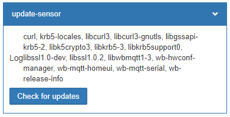

# update-notify-2wb
## Описание

Скрипт для уведомления об обновлениях ПО Wiren Board. Написано на wb-rules.

Добавляет устройство *update-sensor* c текстовым топиком *Log* и кнопкой *Check for updates*. В *Log* скрипт выводит список пакетов доступных для обновления.

Проверка обновлений происходит при нажатии на кнопку, перезапуске движка правил и дважды в день: в 5 и 11 часов. Время и периодичность запуска можно изменить в объявлении правила _cron_check_update_.

## Установка

Скопируйте файл *update-notify-2wb.js* в папку с пользовательскими скриптами wb-rules, или создайте новый скрипт в веб-интерфейсе и вставьте в него содержимое файла.
